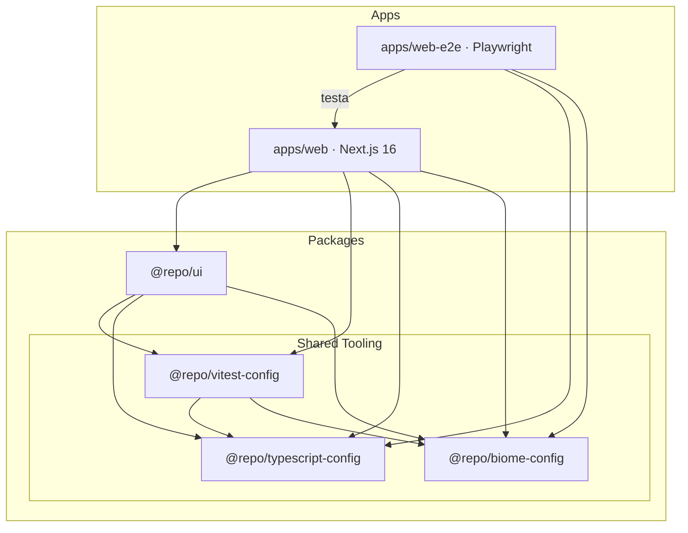

[](http://commitizen.github.io/cz-cli/)
[](https://nodejs.org/)
[](https://pnpm.io/)

# ts-monorepo-template

Template de base para aplicações web — monorepo pnpm + Turborepo com Next.js, testes (Vitest + Playwright), CI via Dagger e qualidade de código com Biome. Pronto para começar com XP: TDD, trunk-based git e commits convencionais.

## Estrutura do projeto



## Quick Start

<details>
<summary>🐳 Docker (recomendado)</summary>

```sh
git clone <url-do-repo> && cd ts-monorepo-template
make build
make up
```

App disponível em `http://localhost:3000`.

</details>

<details>
<summary>💻 Local (dev)</summary>

```sh
git clone <url-do-repo> && cd ts-monorepo-template
pnpm install
pnpm dev
```

App disponível em `http://localhost:3000`.

</details>

## Features

| Área | O que resolve |
|---|---|
| **Zero-config tooling** | Biome (lint + format), TypeScript strict e Vitest pré-configurados e compartilhados entre todos os packages |
| **Testes em todas as camadas** | Unit/integração com Vitest + Testing Library e E2E cross-browser com Playwright |
| **CI production-ready** | GitHub Actions + Dagger: build, testes, commitlint, cobertura, Semgrep SAST e TruffleHog |
| **Segurança desde o commit** | Hooks `pre-commit` e `pre-push` bloqueiam secrets e vulnerabilidades antes de chegar ao remoto |
| **Commits à prova de falha** | Commitizen + commitlint enforçam gitmoji conventional em todo o time |

## Pré-requisitos

| Ferramenta | Versão mínima |
|---|---|
| Node.js | `>= 24.0.0` |
| pnpm | `10.33.0` |
| Docker | qualquer |
| Dagger CLI | qualquer |
| TruffleHog | qualquer (CLI nativo) |

> Instale o pnpm com `corepack enable && corepack prepare pnpm@10.33.0 --activate`.

> Instale o Dagger CLI conforme a [documentação oficial](https://docs.dagger.io/install). O Dagger é utilizado pelos workflows de CI no GitHub Actions.

> Docker é necessário para os hooks locais de SAST (`pre-commit` e `pre-push`) e para os comandos `make`. As rulesets do Semgrep estão definidas em `config/semgrep-rules.txt`.

> Instale o TruffleHog com `brew install trufflehog` (macOS/Linux), `choco install trufflehog` (Windows) ou via [GitHub Releases](https://github.com/trufflesecurity/trufflehog/releases). O binário `trufflehog` deve estar no `PATH` — os hooks `pre-commit` e `pre-push` o chamam diretamente.

## Instalação e execução local

```sh
# Clone o repositório
git clone <url-do-repo>
cd ts-monorepo-template

# Instale as dependências
pnpm install

# Inicie o servidor de desenvolvimento
pnpm dev
```

O app `web` estará disponível em `http://localhost:3000`.

Para rodar apenas o frontend:

```sh
pnpm turbo dev --filter=web
```

## Comandos principais

### Desenvolvimento

```sh
pnpm dev              # inicia todos os apps
pnpm build            # build de todos os pacotes/apps
```

### Testes unitários e integração

```sh
pnpm test             # executa todos os testes uma vez
pnpm test:watch       # modo watch
pnpm test:coverage    # executa com relatório de cobertura em /coverage

# Testar um projeto específico
pnpm vitest run --project=web
pnpm vitest run --project=@repo/ui
```

### Testes E2E (Playwright)

Execute a partir de `apps/web-e2e/`:

```sh
pnpm test:e2e         # suite completa (todos os browsers)
pnpm test:e2e:smoke   # smoke em Chromium
pnpm report           # abre o último relatório HTML
```

> O Playwright auto-inicia `pnpm --filter=web start` antes dos testes quando fora do CI. Exige que o build de `web` já tenha sido executado.

### Qualidade

```sh
pnpm lint             # biome ci em todos os pacotes
pnpm check-types      # tsc --noEmit em todos os pacotes
pnpm format           # biome format --write (auto-correção)
```

### Segurança (varredura manual)

```sh
pnpm security:sast     # Semgrep SAST em todo o repositório (via Docker)
pnpm security:secrets  # TruffleHog em todos os arquivos rastreados pelo git
```

### Commits

```sh
pnpm commit           # assistente interativo gitmoji conventional (commitizen)
```

## Qualidade e convenções

### Biome

Substitui ESLint e Prettier. Configuração compartilhada em `packages/biome-config`. Largura de linha: 120, indentação: 2 espaços, regras recomendadas ativas.

### Husky hooks

| Hook | O que faz |
|---|---|
| `pre-commit` | `lint-staged` (Biome check + write nos arquivos staged) → TruffleHog nos arquivos staged → Semgrep SAST via Docker nos arquivos staged |
| `commit-msg` | `commitlint` com config gitmoji — rejeita commits fora do padrão |
| `pre-push` | TruffleHog no range de commits do push → Semgrep SAST via Docker nos arquivos alterados no push → `turbo run build check-types test:e2e` — bloqueia o push se qualquer etapa falhar |

### Formato de commits

Commits seguem o padrão **gitmoji conventional**: `<emoji> <tipo>(<escopo>): <descrição>`.

Use `pnpm commit` para o assistente interativo ou escreva manualmente seguindo o padrão.

## CI

Seis workflows em `.github/workflows/`:

| Workflow | Trigger | O que faz |
|---|---|---|
| `check.yml` | PRs para `main` | Qualidade de código + build (via Dagger) |
| `tests.yml` | PRs para `main` | Testes unitários + cobertura (artifact 30 dias) e E2E completo (todos os browsers); faz upload do report Playwright em falha (via Dagger) |
| `commitlint.yml` | PRs para `main` (exceto Dependabot) | Lint do título e range de commits do PR (via Dagger) |
| `security.yml` | PRs para `main` | Semgrep SAST (com upload SARIF para GitHub Code Scanning) + TruffleHog secret scan (via Dagger) |
| `dependabot-auto-merge.yml` | PRs do Dependabot para `main` | Aprova e habilita squash-merge automático para atualizações minor/patch |
